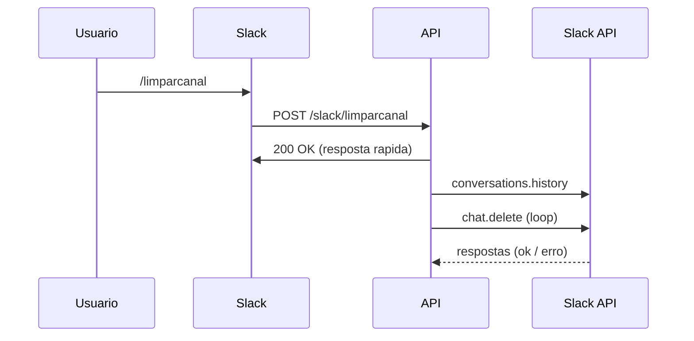

---

# 🧹 Slack Channel Cleaner


API em Node.js para limpeza automatizada de mensagens em canais do Slack via **Slash Command**.

---

## ✨ Visão Geral

Este projeto permite executar um comando diretamente no Slack:

```bash
/limparcanal
```

E automaticamente:

* Lê o histórico do canal
* Tenta apagar mensagens
* Trata rate limits
* Executa de forma assíncrona e segura

---

## ⚠️ Limitação importante

> 🔴 A API do Slack **não permite apagar mensagens de outros usuários com um bot comum**

✔ O que funciona:

* Mensagens do próprio bot
* Mensagens que o token tem permissão

❌ O que não funciona:

* Limpar completamente um canal de terceiros

---

## 🧠 Arquitetura



---

## 🏗️ Estrutura do Projeto

```bash
.
├── index.js
├── package.json
└── README.md
```

---

## ⚙️ Variáveis de Ambiente

Configure no Railway:

```env
SLACK_BOT_TOKEN=xoxb-xxxxxxxx
SLACK_SIGNING_SECRET=xxxxxxxx
```

---

## 🔐 Segurança

A aplicação valida requisições do Slack usando:

* `x-slack-signature`
* `x-slack-request-timestamp`
* HMAC SHA256

Protegendo contra:

* requisições falsas
* replay attacks

---

## 🚀 Endpoint

### POST `/slack/limparcanal`

Recebe o Slash Command do Slack

---

## 📥 Exemplo de Request (Slack → API)

```http
POST /slack/limparcanal
Content-Type: application/x-www-form-urlencoded

token=xxx
team_id=T123
channel_id=C123456
channel_name=geral
user_id=U123
command=/limparcanal
text=
```

---

## 📤 Exemplo de Response (API → Slack)

```text
Recebi o comando. Tentando limpar #geral...
```

---

## 🔄 Fluxo interno

```bash
1. Recebe requisição
2. Valida assinatura
3. Responde em < 3s
4. Executa limpeza:
   ├── busca mensagens
   ├── tenta deletar
   ├── trata erros
   └── respeita rate limit
```

---

## 🔧 Principais funções

### `limparCanal(channelId)`

* pagina mensagens (`cursor`)
* itera sobre mensagens
* chama delete

---

### `apagarMensagem(channel, ts)`

* tenta deletar
* trata:

  * `cant_delete_message`
  * `ratelimited`
* retry automático

---

## 🔑 Permissões necessárias (Slack)

Em **Bot Token Scopes**:

```bash
channels:history
groups:history
channels:read
groups:read
chat:write
```

👉 Após adicionar:
**Reinstale o app**

---

## 💬 Slash Command

```bash
Command: /limparcanal
Request URL: https://seu-app.up.railway.app/slack/limparcanal
```

---

## 🚀 Deploy (Railway)

1. Suba no GitHub
2. Conecte no Railway
3. Configure:

```bash
Start Command: npm start
```

4. Adicione variáveis de ambiente
5. Gere domínio público

---

## 🧪 Teste

```bash
GET https://seu-app.up.railway.app
```

Resposta esperada:

```bash
Slack cleaner online
```

---

No Slack:

```bash
/limparcanal
```

---

## 📊 Logs esperados

```bash
Canal recebido: C123456
Apagada 1712345678.0001
Sem permissão para apagar 1712345678.0002
Rate limit. Aguardando 5s...
```

---

## ⚠️ Erros comuns

| Erro                | Causa                   |
| ------------------- | ----------------------- |
| missing_scope       | escopos não adicionados |
| invalid_arguments   | cursor null             |
| cant_delete_message | sem permissão           |
| ratelimited         | excesso de requisições  |
| not_in_channel      | bot não está no canal   |

---

## 🔮 Roadmap

* [ ] Limitar quantidade (`/limparcanal 50`)
* [ ] Filtrar por usuário
* [ ] Confirmar antes de executar
* [ ] Feedback em tempo real
* [ ] Dashboard de logs

---

## 💡 Alternativas para “limpar tudo”

Se quiser limpar 100%:

* Arquivar canal + criar outro
* Usar retenção de mensagens no Slack

---

## 📜 Licença

MIT

---

## 🤝 Contribuição

Pull requests são bem-vindos!
Abra uma issue para discutir melhorias.

---

## 👨‍💻 Autor

Projeto desenvolvido para automação de limpeza de canais Slack via API.

---

